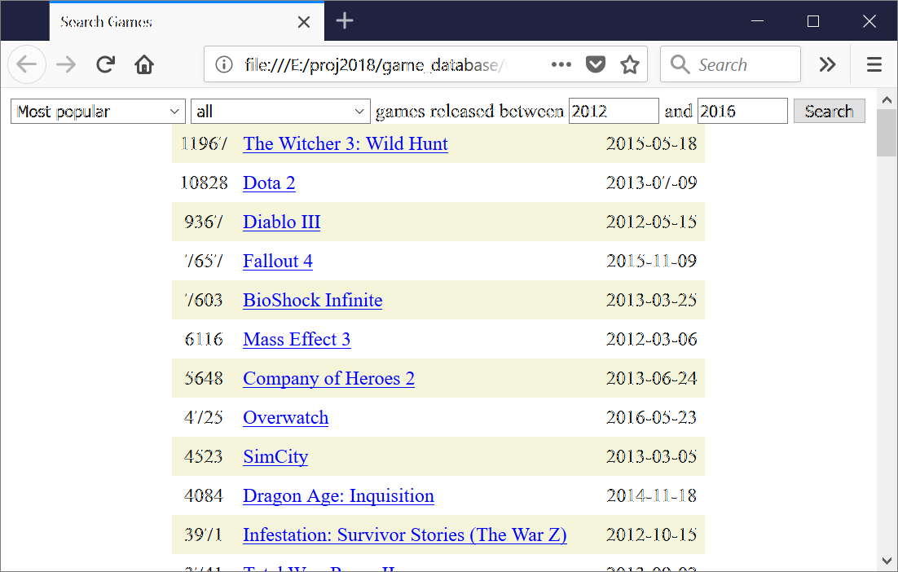
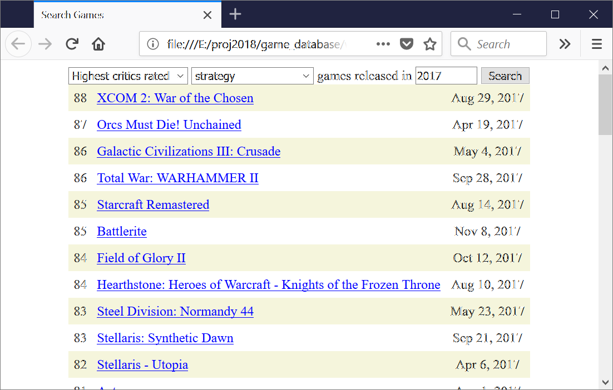

# Game Database

Year: 2018

This project downloads basic video game data from the [metacritic](https://www.metacritic.com/) website and saves it to online databases. This information is then presented in a webpage.

AWS RDS Front End

AWS DynamoDB Front End

## Project Content

**/doc** - project documentation

**/databases** - code for downloading data from Metacritic website and uploading this data into AWS RDS and DynamoDB

**/lambda** - web API backend code to read data from AWS RDS and DynamoDB and return it to the web browser

**/web_page** - web application front end code

