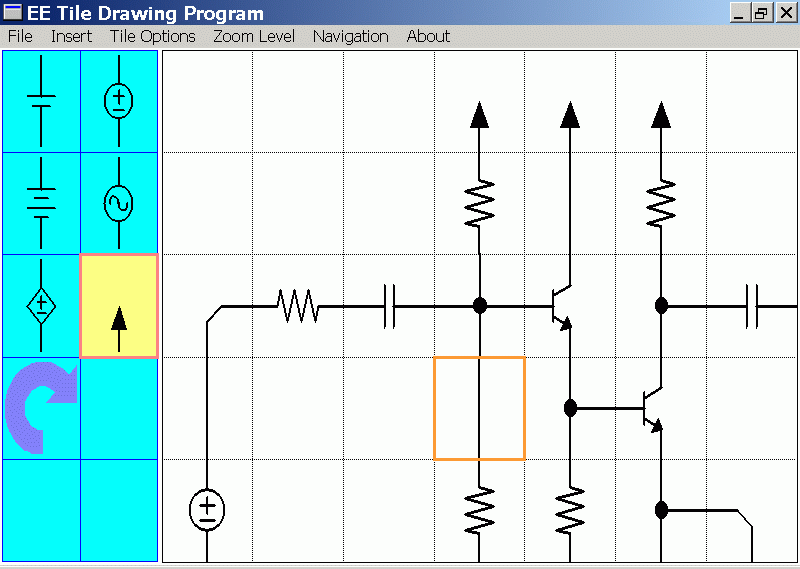

# EE Tile Drawing Program

Year: 2002

This program draws circuits.

Screen shot made in 2002 (GDI+ did not age well, but the code still works)

## Build Instructions

**1. Create an empty C++ project**

The original 2002 project files no longer work. So just create an empty project and add files manually.

**2. Change project character encoding to Unicode**

The Windows programming convention of 2002 was to support Windows 98, which used Ascii. Also, back then UTF-8 was not popular. Instead of UTF-8, Windows used an earlier variant of Unicode.

Project Properties -> Configuration Properties -> General -> Character Set = Unicode

**3. Add "/src" files to project**

**4. Copy "/images" files to project**

The program needs the files in the "images" directory, but where these files go depend on the situation.  Visual C++ has a quirk, in that the "default" directory depends on how the project is being run.

If debugging the project, then the images should go to the directory of the project file. If running the project by double clicking on the ".exe", then the images should go to the directory containing the ".exe" file.

## 2019 Modifications

It's been 17 years since the code was first written, and it has aged well. Only minor modifications were needed.

2002 Code | 2019 Code
------------ | -------------
Color.Black | Color::Black
_stprintf(...) | swprintf_s(...)
TEXT("PROG_MENU") | MAKEINTRESOURCE(PROG_MENU)

and minor modifications to "eetdp.rc"

