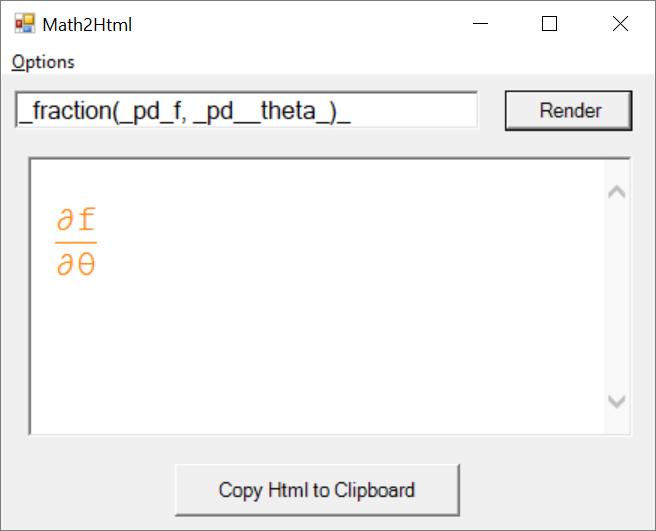

# Math2Html

Year: 2002

This program renders math equations in HTML.

## Potential Modifications

You might need to resize the forms in "EditFraction.vb" and "Form1.vb". 

This project uses WinForm, which predates Windows Vista and does not scale gracefully to different DPI settings. After Windows Vista was released, I switched to WPF due to DPI issues in WinForm.

## Usage

Try the phrase in the screenshot.

Press F1 to see the options available.

